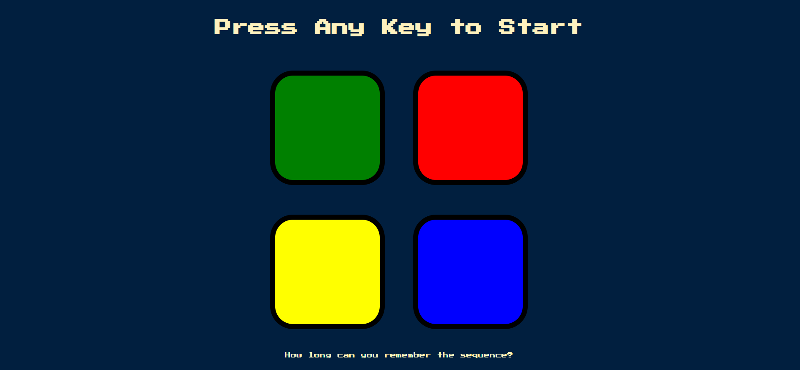

# Simon Game

This is a web-based implementation of the classic electronic memory game, Simon. It offers an engaging and interactive experience for players to test and improve their memory skills. The game is built using HTML, CSS, and jQuery, making it accessible and playable in modern web browsers. With a colorful and intuitive user interface, the Simon Game provides players with a visually appealing and immersive gameplay environment. The game features four large buttons, each associated with a unique color and sound. Players must pay close attention to the sequence of colors and sounds played by the game and replicate it by clicking the buttons in the correct order.

## Features

This website includes the following features:

* **Intuitive User Interface:** The game has a user-friendly and visually appealing interface that allows players to easily interact with the game elements.
* **Four Colorful Buttons:** It includes four large buttons, each representing a different color (red, blue, green, and yellow) to engage players and add a visual aspect to the gameplay.
* **Unique Sounds:** Each button produces a distinct sound, creating an immersive audio experience and aiding players in remembering the sequence.
* **Progressive Difficulty:** The game gradually increases in complexity as players successfully replicate each sequence, challenging their memory skills and providing an exciting gameplay experience.
* **Audio and Visual Feedback:** The game provides immediate feedback through sound and visual cues to inform players whether they have correctly replicated the sequence or made a mistake.

## Technologies Used

This website is built using the following technologies:

* **HTML:** It is used for structuring the elements of the game, such as buttons, score display, and other UI components.
* **CSS:** It is utilized for styling and customizing the appearance of the game, including colors, layouts, and animations.
* **jQuery:** It is a JavaScript library that simplifies and enhances the manipulation of HTML elements, event handling, and animations. It is employed to streamline the development process and make the game more interactive and dynamic.

These technologies were chosen for their widespread use, compatibility with web browsers, and their ability to create interactive and visually appealing web pages.

## 🛠 Installation and Setup Instructions

1. git clone https://github.com/tawfik575/simon-game.git
2. cd simon-game
3. start index.html

## Contributing

Contributions to Simon Game are welcome! If you find a bug or have an idea for an improvement, please submit an issue or create a pull request. Make sure to follow the existing code style and provide detailed information about your changes.

## License

This project is licensed under the MIT License. Feel free to use, modify, and distribute the code as per the terms of the license.

## Contact

If you have any questions, suggestions, or feedback about the project, feel free to contact me at `tawfikbsmrstucse@gmail.com`.
